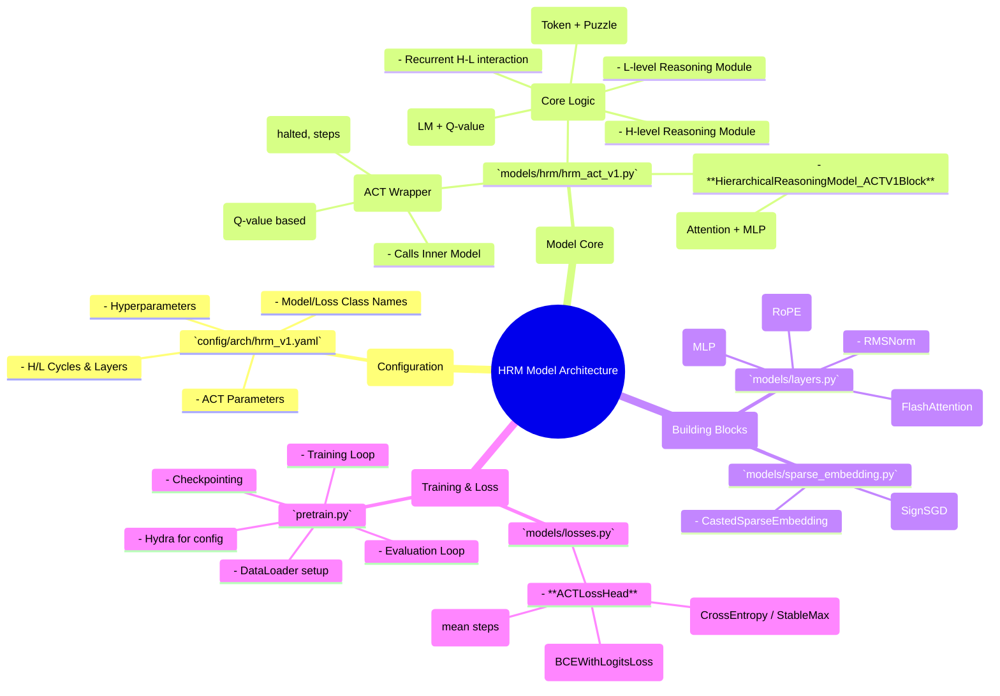
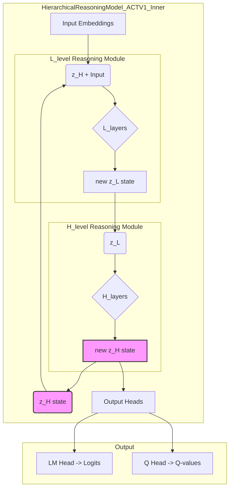
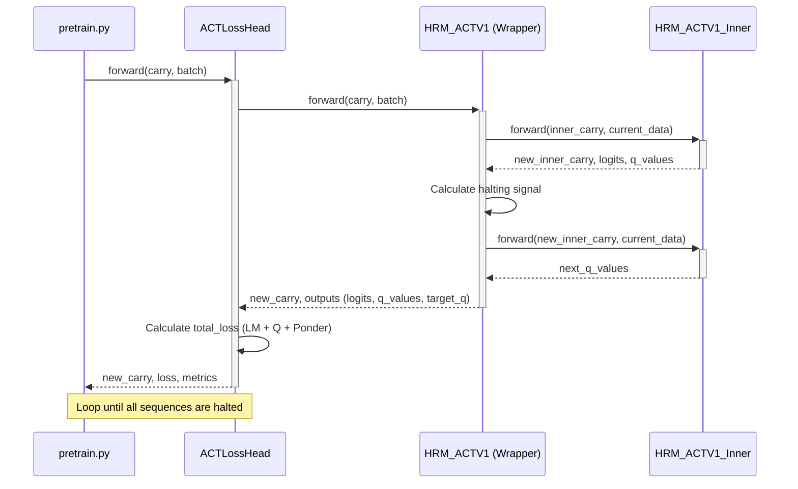

# HRMモデルアーキテクチャ解説

このドキュメントでは、HRM (Hierarchical Reasoning Model) プロジェクトのモデルアーキテクチャについて、ソースコードを基に詳細に解説します。

## 1. 概要

このプロジェクトのHRMは、階層的な推論構造を持つTransformerベースのモデルです。特に、**Adaptive Computation Time (ACT)** のメカニズムを導入しており、問題の複雑さに応じて計算ステップ数を動的に調整することができます。これにより、単純な問題は素早く解き、複雑な問題にはより多くの計算リソースを割くことが可能になります。

主な構成要素は以下の通りです。
- **階層的推論モジュール**: 高レベル(H-level)と低レベル(L-level)の2つの推論モジュールが相互作用し、推論を深化させます。
- **Adaptive Computation Time (ACT)**: 計算をいつ停止するかをモデル自身が学習するための機構です。
- **カスタムビルディングブロック**: `flash_attn`を利用した効率的なAttentionや、`bfloat16`への自動キャストをサポートするカスタムレイヤーを使用しています。
- **複合的な損失関数**: 言語モデルとしての損失、ACTのQ学習損失、計算コスト（Ponder Loss）を組み合わせた損失関数でモデルを訓練します。

## 2. アーキテクチャMindMap

モデル全体の構成要素をMindMapで示します。

## 3. 主要ファイルと役割

| ファイルパス | 役割 |
| :--- | :--- |
| `config/arch/hrm_v1.yaml` | モデルの構造や損失関数、ACTの挙動を定義する中心的な設定ファイル。 |
| `models/hrm/hrm_act_v1.py` | HRMモデルのコアロジックを実装。ACTのラッパーと、階層的推論を行う内部モデルが含まれる。 |
| `models/layers.py` | Attention、MLP、Rotary Embeddingなど、Transformerを構成する基本的なレイヤーを定義。 |
| `models/sparse_embedding.py` | パズル固有の情報を埋め込むための特殊なスパース埋め込み層と、そのためのカスタムオプティマイザを定義。 |
| `models/losses.py` | `ACTLossHead`を定義。言語モデル損失、Q学習損失、Ponder損失を組み合わせて最終的な損失を計算する。 |
| `pretrain.py` | 学習全体のプロセスを管理するスクリプト。データ読み込み、モデルとオプティマイザの初期化、学習・評価ループを実行する。 |

## 4. モデルアーキテクチャ詳細

### 4.1. 階層的推論 (HierarchicalReasoningModel_ACTV1_Inner)

モデルの心臓部は`HierarchicalReasoningModel_ACTV1_Inner`クラスです。このクラスは、高レベル(`H_level`)と低レベル(`L_level`)の2つの推論モジュールを持ちます。

- **`L_level` (低レベルモジュール)**: `z_H`（高レベルの状態）と`input_embeddings`（入力情報）を受け取り、より具体的な特徴を抽出します。
- **`H_level` (高レベルモジュール)**: `z_L`（低レベルの状態）を受け取り、より抽象的な情報を統合・更新します。

推論は以下のフローで行われます。これは`H_cycles`と`L_cycles`（設定ファイルで定義）のネストしたループで実行されます。

この図のように、`L_level`と`H_level`が相互に状態を更新しあうことで、階層的な推論が実現されます。`z_H`の状態がループを通じて維持・更新されることが、このモデルの recurrent な性質の核となっています。

### 4.2. Adaptive Computation Time (ACT)

ACTは、`HierarchicalReasoningModel_ACTV1`クラスによって管理されます。このクラスは内部モデル(`_Inner`)をラップし、計算をいつ停止（halt）するかを決定します。

- **Carry State**: `HierarchicalReasoningModel_ACTV1Carry`は、計算ステップをまたいで情報を保持します。これには、内部モデルの状態(`inner_carry`)、現在の計算ステップ数(`steps`)、各バッチ要素が停止したかどうか(`halted`)が含まれます。
- **Halting Condition**: 各ステップで、モデルは「計算を継続する価値」(`q_continue_logits`)と「計算を停止する価値」(`q_halt_logits`)を出力します。`q_halt_logits > q_continue_logits`となった場合、そのデータに対する計算は停止します。また、最大ステップ数(`halt_max_steps`)に達した場合も強制的に停止します。
- **Loss Function (`ACTLossHead`)**: ACTを機能させるための損失関数は3つの要素からなります。
    1.  **LM Loss**: 主タスクの損失（予測がどれだけ正しいか）。
    2.  **Q-Loss**: Haltingの判断を学習するための損失。現在のステップで計算を継続した場合の価値（Q-value）が、次のステップで得られるであろう最大の価値と一致するように学習します。
    3.  **Ponder Loss**: 計算ステップ数に対するペナルティ。不要に計算を続けることを防ぎます。

## 5. シーケンス図

学習時の1バッチにおける、主要なクラス間のインタラクションをシーケンス図で示します。

この図は、`pretrain.py`から呼び出された`forward`パスが、どのように各コンポーネントを連携させて損失を計算し、次の状態(`new_carry`)を返すかを示しています。特に、`HRM_ACTV1`が内部モデルを2回呼び出して、Q学習のためのターゲット価値を計算している点が重要です。
